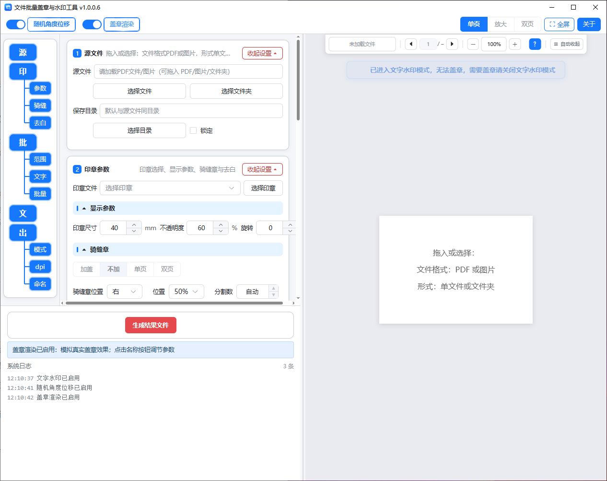

# 文件批量盖章与水印工具

Windows 桌面软件：PDF 批量盖章（页面章 / 骑缝章 / 按文字盖章）、PDF 文字水印、图片批量水印，本地处理、所见即所得，支持把批量任务交给 AI 智能体完成。

## 致谢

本项目取用了 [flytkgl/PDFQFZ](https://github.com/flytkgl/PDFQFZ) v1.33 的部分代码，感谢原作者开源维护。

## 使用说明

### 一、安装与配置

本软件为单文件免安装程序，下载后直接运行即可。首次运行后，会在 EXE 同目录生成一些配置文件，因此建议将 EXE 单独放在一个文件夹中运行，再发送快捷方式到桌面使用，以免误删或误改配置文件。

**首次运行软件后，软件目录结构介绍：**

- 软件主程序（EXE）；
- 《智能体用户使用说明.md》（用户使用智能体调用前必看）；
- WebView2Loader.dll（界面渲染引擎）；
- app_log.log（运行日志：记录本次与上次运行全过程，复现问题后请提供此文件）；
- 「运行组件」文件夹：
  - 「WebUI」：软件界面文件；
  - 「WebView2缓存」：内核缓存；
  - 「印章库」：存储用户导入的印章图片；
  - pdfium.dll（PDF 渲染引擎）、config.ini（软件配置文件）；
  - 「智能体调用」：
    - 《智能体调用手册.md》（供 AI 智能体阅读的使用手册，出厂内容，每次启动软件自动重置为官方版本）；
    - 《补充手册.md》（记录你的使用习惯与成功经验，软件不会覆盖它，由智能体经你确认后写入，可随时查看修改）；
    - 「智能体调用任务模板」（供 AI 智能体调用的工作任务模板）；
    - 「智能体调用工作过程文件」（智能体执行任务时产生的任务文件与日志，统一存放于此，可随时根据需要清理）。

### 二、快速开始

**主要功能介绍：**

1. PDF 文件：页面盖章、盖骑缝章、加文字水印，带批量处理功能（亮点功能：随机角度位移与印章渲染，让盖章效果模拟现实盖章的随机性，不再每页完全一致）；
2. 图片：加文字水印，带批量处理功能；
3. 为智能体调用软件，专门在运行组件内加入了《智能体调用手册》，使智能体调用本软件盖章更加高效。

**PDF 盖章 / 水印：**

1. 将 PDF 文件或文件夹拖入软件预览区，或点击「选择文件 / 选择文件夹」按钮选取；
2. 选择印章并设置参数，或启用文字水印添加水印框；
3. 在左侧导航选择要用的功能，在控件区调试功能；
4. 使用盖章、批量盖章、水印功能进行操作；在预览区点鼠标右键可以删除印章，也可以鼠标拖动印章调整印章位置；
5. 在预览区确认效果无误后，点击底部「生成结果文件」，输出结果文件，在系统日志内可以看到输出的文件名与目录。

**图片水印：**

1. 将图片或图片文件夹拖入软件预览区，或点击「选择文件 / 选择文件夹」按钮选取；
2. 添加文字水印框，双击编辑文字、调整参数；
3. 点击「生成结果文件」，输出带水印的图片，在系统日志内可以看到输出的文件名与目录。

**保存目录：**

- 单文件时，输出文件默认保存在源文件同目录；
- 文件夹模式下，默认保存到源文件夹下的「已处理」目录；
- 输出文件名默认「源文件名 + 已处理V + 编号」递增（如 1.pdf → 1_已处理V1.pdf），源文件不会被覆盖。

### 三、智能体调用

1. 本软件支持把批量任务交给 AI 智能体（如豆包工作任务模式、WorkBuddy 等）处理：你只需把软件文件夹挂载到智能体工作区并说明需求，智能体会自动完成盖章 / 水印并反馈结果，不需要自己操作界面。
2. **第一步（准备工作）**：把本软件文件夹（存放本软件主程序 EXE 的文件夹）挂载到智能体的工作区 / 项目文件夹中；先双击运行一次 EXE（让「运行组件」等文件由程序自动生成到本软件文件夹内），并在软件界面内把印章添加好。
3. **第二步（开始对话）**：阅读本软件文件夹内《智能体用户使用说明.md》，按文件内容做好相应准备工作后，复制文件内的开场白文字发给智能体；智能体自行阅读《智能体调用手册.md》，然后引导你说明需求并执行任务。
4. **（可选）智能体调用 Skill 包**：运行一次软件后，「运行组件\智能体调用\」下自动生成《智能体调用手册.md》与技能包文件夹「file-stamp-watermark」（技能包 = 手册知识的标准化封装：操作知识 + 4 个任务模板 + 调用脚本，跨平台通用，支持豆包 / WorkBuddy / DeepSeek；**技能包版本号由软件运行时按当前版本自动注入，与软件版本永远一致**）。你只需发送《智能体用户使用说明.md》内的开场白（让智能体读取调用手册）；智能体读完手册后会判断技能包能否加载并**核对技能包版本与软件版本是否一致**——能加载时请你选择 A（直接按调用手册工作）或 B（加载技能包后工作）；不能加载（含版本不一致）时如实告知只能选 A，并告诉你技能包所在位置（运行组件\智能体调用\file-stamp-watermark\），可自行想办法安装（如让智能体检查调整该文件夹、按平台要求放入技能目录）；若因软件升级版本不一致，重新运行一次软件即可自动更新技能包，装好后下次对话即可选 B。两种方式处理效果完全一致。
5. 发送开场白后，智能体会引导你说明需求并执行任务。

### 四、左栏功能导航

左侧导航是操作控件的启用与关闭，点中一级或二级按钮即启用该功能区并显示对应控件。

### 五、盖章方式介绍

1. 手动点击盖章：在预览区左键单击空白处盖章；左键单击已有印章可叠加盖章；右键单击已有印章可删除。
2. 批量盖章：指定范围页 / 按文字 / 批处理文件三种方式。批量印章也可通过右键单击删除。
3. 批量盖章 1（指定范围页盖章，仅对当前文件生效）：输入起始页与结尾页，确定后在范围内批量盖章；范围内点击「结束页」自动为每页盖章，翻页限定在范围内。
4. 批量盖章 2（按文字盖章，文件夹模式下对文件夹内所有文件生效，单文件模式对当前文件生效）：输入需要盖章的文字（如公司名称），点击「按文字放置印章」可进行效果预览。多个关键词可用逗号、分号、顿号、空格分隔；可设置上下文范围（目标文字前后多少字内匹配，默认 10 字）、匹配模式（全部关键词 / 任一关键词）、中心偏移；成功盖章的关键词自动存入搜索历史（近期 10 个），点输入框下拉可查看、可删除。注：图片型 PDF 没有文字层，不支持此方式。
5. 批量盖章 3（批处理文件盖章，对文件夹内所有文件生效）：文件夹模式下开启，给文件夹内全部 PDF 盖章。设置页码范围（所有页 / 首页 / 尾页 / 自定义）与盖章位置（X/Y 百分比，以页面左上角为原点），点击「批量放置印章」可进行效果预览。

### 六、随机角度位移与盖章渲染

1. 功能旨在于模拟人工盖章会产生的偏移、旋转及每页印章效果微差，使输出文件的印章效果更加真实。
2. 两个模块的开关与按钮在预览区上方工具条左侧，开启后点击按钮打开参数面板进行配置。
3. 随机角度位移：开启后盖章时按设定范围随机旋转与位移，模拟手工盖章效果。参数面板：旋转角度、横向位移、纵向位移。
4. 盖章渲染：开启后模拟真实盖章的纹理与色调效果。参数面板分三组：明暗与纹理（浓淡不均 / 径向压印 / 局部露白）、斑点（内部斑点 / 斑点大小）、色调与过渡（渐变过渡 / 整体色偏）；另有参数预设 1~4，可保存 / 加载 / 恢复默认。
5. 盖章渲染调试技巧：导入一个空白PDF页面，打开盖章渲染功能，在空白页面上盖几个章子，放大页面，到能看清章子细节；在盖章渲染的参数弹窗内，调整各项参数，观察章子变化，直到基本符合需求，然后可以保存参数；下次需要直接加载此参数即可； 

### 七、印章参数

1. 印章文件：下拉切换印章；选项右侧 ✎ 重命名、✕ 删除；「选择印章」按钮导入新图片（PNG/JPG）。
2. 显示参数：尺寸（单位 mm）、不透明度（百分比）、旋转（单位度）。
3. 骑缝章设置：加盖 / 不加 / 单页 / 双页；骑缝位置（右 / 左 / 上 / 下）、位置百分比、分割数（默认「自动」按文档页数自动调整，可点 ▲ 进入手动数字；单页文档无需骑缝章，类型自动锁定「不加」）。
4. 图章去白：在左侧导航选中「印章参数 → 去白」即启用，自动去除印章图片的白色背景，容差可调。

### 八、文字水印

1. 在左侧导航点「文」启用文字水印（PDF 与图片模式通用），点「添加文字水印」在当前页 / 当前图片加框。
2. 水印框操作：双击框内文字进入编辑，Enter 可手动换行；文字超出框宽会自动换行；框下有旋转按钮与移动按钮，鼠标按住按钮操作；水印框四角圆点可通过鼠标操作缩放，调整水印框与其中文字的大小；选中水印框后 Ctrl+C / Ctrl+V 可复制 / 粘贴水印框；右键水印框可复制 / 粘贴 / 保存当前页方案 / 删除；选中水印框按 Delete 键可删除。
3. 其他参数：字体（微软雅黑 / 宋体 / 黑体 / 楷体 / 仿宋）、字号、颜色（快捷色板 + 自定义）、透明度、旋转、行距、字间距、对齐（左 / 中 / 右），调整即时生效。

### 九、预览区操作

1. 视图切换（预览工具条）：单页 / 放大 / 双页（图片模式仅单页 / 放大）。
2. 预览区上方悬浮工具条（PDF 与图片共用同一套）：文件下拉框（切换当前文件 / 图片）；◀ ▶ 上 / 下一页（图片模式为上一 / 下一张）；页码输入框（输入后回车跳转）；－ / ＋ 缩小 / 放大（Ctrl + 滚轮也可缩放）；「常驻 / 自动收起」（切换工具条显示方式）。
3. 单页视图：鼠标滚轮翻页。
4. 双页视图：两页并排预览，随窗口自适应缩放，支持鼠标滚轮翻页。
5. 放大视图：左键按住拖动页面；滚轮上下滚动阅读（滚到底 / 滚到顶自动翻到下一页 / 上一页）；Ctrl + 滚轮缩放页面。

### 十、输出设置

1. 输出模式：合并模式（盖章 / 水印直接合入页面内容，合并后文字不可编辑）/ 叠加模式（盖章以可编辑元素浮于页面上）。
2. 输出文件 DPI：极高 300 / 高 200 / 标准 150 / 低 96 / 极低 72（默认标准），DPI 越大文件越清晰、占用空间越大；仅对合并（栅格化）模式生效，叠加模式不受影响。
3. 输出文件名后缀：可设置命名文字、编号位置（前 / 后）、递增类型（数字 / 字母）、位数与时间戳；默认「已处理V + 编号」。同一源文件已存在的输出自动使用 V1、V2、V3 等版本号递增，不覆盖旧结果，例如 1.pdf 输出为 1_已处理V1.pdf。
4. 首次启动默认：不加骑缝章、手动点击盖章、合并模式、文字水印关闭。

### 十一、常见问题

**Q：如何调整印章尺寸，使其与真实印章一致？**

A：导入一份盖有真实印章的 PDF 作参照，再导入对应的印章 PNG；在「印章参数」中调整尺寸，在参照 PDF 上盖章比对，反复微调直至一致。

**Q：为什么生成的 PDF 变大了？**

A：DPI 越高文件越大越清晰；「输出文件DPI」选标准 150 即可兼顾清晰度与文件大小。

**Q：如何给文件夹内所有文件盖章？**

A：先选择文件夹，再在导航开启「批量盖章 → 批量（批处理文件）」或「按文字批量」，按参数设置后批量处理。

**Q：如何让印章看起来像手工盖的？**

A：开启工具条左侧「随机角度位移」并调节旋转角度与横纵位移，同时开启「盖章渲染」模拟真实纹理与色调，效果更接近手工。

**Q：图片型 PDF 能按文字盖章吗？**

A：不能。图片型 PDF 没有文字层，仅支持手动或批量位置盖章。

**Q：图片能盖印章吗？**

A：不能。图片模式仅支持文字水印，需要盖章请转为 PDF 文件导入。

**Q：印章有白底怎么办？**

A：在左侧导航选中「印章参数 → 去白」，调整容差去除白色背景。

**Q：水印文字如何换行？如何调整大小？**

A：双击水印框编辑文字，Enter 换行；文字超出框宽也会自动换行。拖动水印框、调整框大小，文字会随之自动调整大小。

**Q：印章旋转后被切角是怎么回事？**

A：部分非圆形印章，或印章在图片上不居中时，旋转时会被切边；建议在图片中给印章四边留空区域大一些，可避免旋转时裁切边缘；留白越大，相同尺寸下章内容显示越小，需自行调大印章尺寸。

**Q：智能体的工作模式是什么样的，工作效果好坏取决于什么？**

A：在智能体工作模式下，本软件仅仅属于智能体的盖章工具，智能体理解了本软件的各种盖章方法，通过智能体与用户对话了解需求，来确定盖章页面、盖章位置等内容，然后智能体调用本软件来实施。具体的工作效果好坏，基本上取决于智能体本身、用户的需求描述等方面，本软件作为一个工具，不参与盖章决策。

**Q：智能体的工作模式比人工使用软件的有什么优点？或者说智能体的工作模式更适合处理什么样的工作？**

A：简单的、少量的文件处理，由人工处理更加方便。如果是重复性的，或者大量需要人工甄别的工作，可以尝试使用智能体处理，例如有 100 份文件，文件内容与页数均不相同，需要在某些特定位置盖章，无法通过按文字盖章识别，需要人工识别具体的盖章位置时：

1. 合同尾页双方公司盖章处、承诺书处、报价书尾页处等本公司名称的位置盖章，在正文内出现的公司名称处不盖章；
2. 某些页面上，两个公司名称离得很近，需要盖章在其中一个公司名称上，而印章不能压到另外一个公司名称。

以上均属于需要人工识别的工作，而印章软件无法做到这些工作，在以上工作量大时，可以尝试给智能体描述清楚需求，让智能体按规则调用盖章软件进行盖章。

**Q：智能体说《智能体调用手册.md》每次启动会重置，我的使用习惯怎么保存？**

A：告诉智能体你的习惯与成功经验，它会经你确认后写入「运行组件\智能体调用\补充手册.md」——软件不会覆盖这个文件，这个文件属于你与智能体交互工作后存留的经验记录，下次同类任务自动沿用。例如上面提到的各种结合用户自身需求的任务，每个任务完成后，可以由智能体总结经验存放到补充手册内，这样随着用户的使用，智能体每次工作前可以参考同类的完成经验，进而越来越高效。

**Q：智能体执行任务时产生的过程文件放在哪里？**

A：统一放在「运行组件\智能体调用\智能体调用工作过程文件\」目录，可随时查看或清理，不影响软件使用。

## 支持本项目

本项目核心功能完全免费、源码完全开源（MIT 协议）。如果你觉得这个工具对你的工作有所帮助，愿意赞助作者，支持工具的后续迭代维护与其他办公小工具的开发，可以在以下链接赞助：

https://afdian.com/a/gggg312

注：不赞助也完全没关系——赞助与否，核心功能完全一样！核心功能完全一样！核心功能完全一样！重要的事情说三遍！

当然，如果有赞助者，作者还是想表示感谢，因此愿意为赞助者提供「赞助版」：所有功能与免费版完全一致，仅额外开启一些趣味小彩蛋（软件主题色切换、统计等级徽章、标题栏文字可自行修改）。请赞助者在上方赞助内留下电子邮箱，作者会给您发送赞助版。

另外，赞助版的功能在源码里面也都有，您愿意的话，也可以自己下载源码编译 EXE 文件，自己生成赞助版来使用。

## 协议

MIT © 2026
